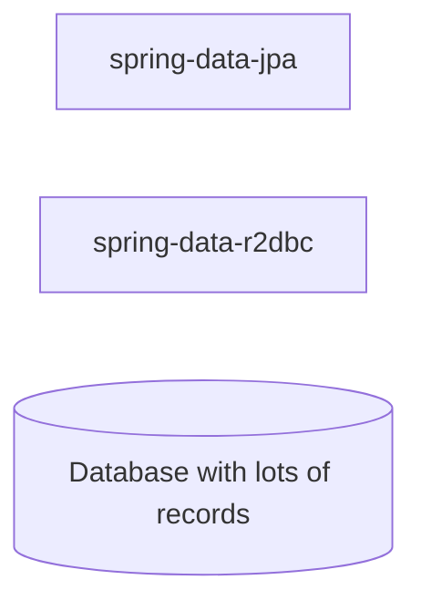

# Notes

---

- Test the layer where application is writing to the database.

---

## Setup

## For reference

- https://github.com/vinsguru/spring-webflux-course/tree/master/04-r2dbc-vs-jdbc/reactive-vs-traditional-postgres

---

## How R2DBC works - Traditional vs Reactive

---

## Spring Data JPA

- R2DBC is relatively new. Late 2022
- Performance has to be measured. It cannot be guessed. It can depend on the application / implementation
  - Take frequently used / high throughput scenarios for the applicatoin
  - Do performance tests for the application using R2DBC
  - Monitor using tools like: new relic, jconsole, pgadmin, netstat...check out others

---

## Reactive Manifesto / Reactive Systems