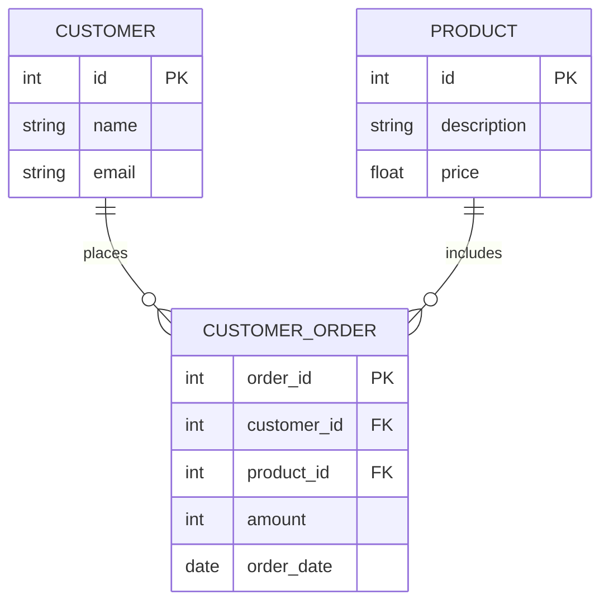

# Implementation Details

---

## Tables / Database Schema

### customer
- id
- name
- email

### product
- id
- description
- price 

### customer_order
- order_id
- customer_id
- product_id
- amount
- order_date

## ER Diagram

