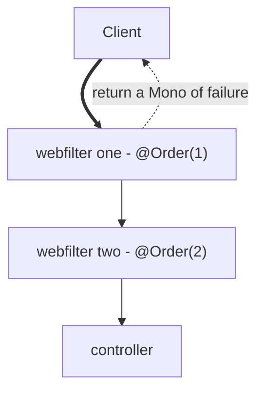

# Webfilter notes

---

- Handles cross cutting concerns like authentication, authorisation
  - Do not do request body validation
- Can access path,header, parameters, cookies etc
- We can chain multiple WebFilters to do multiple validations before the request reaches the controller
- Ordered using the `@Order(x)` annotation

